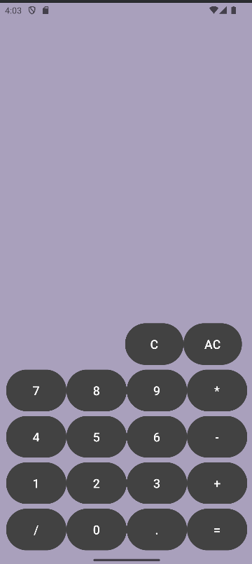

# 📱 Calculator Android App

This is a simple **Calculator Android Application** developed in **Android Studio** using **Java and XML**.
The app performs basic arithmetic operations and also includes a **Splash Screen** when the app starts.

---

## ✨ Features

* Basic arithmetic operations:

  * Addition (+)
  * Subtraction (-)
  * Multiplication (×)
  * Division (÷)
* Simple and user-friendly UI
* Button-based input system
* Displays result instantly
* **Splash Screen** added before opening the main calculator
* Built using **Android Studio**

---

## 🛠 Technologies Used

* **Java**
* **XML**
* **Android Studio**

---

## 📂 Project Structure

* `MainActivity.java` → Handles calculator logic
* `activity_main.xml` → UI layout for calculator
* `MainActivity2.java` → Splash screen activity
* `activity_main2.xml` → Splash screen layout
* `drawable` → Images used in splash screen

---

## 🚀 How the App Works

1. When the app starts, a **Splash Screen** appears for a short time.
2. After that, the **Calculator screen** opens.
3. Users can enter numbers and perform operations.
4. The result is displayed on the screen.

---

## 📸 Output Screenshot

## 👩‍💻 Author

**Dikshita**
GitHub: https://github.com/Dikshita1824

---

## 📌 Repository Link

https://github.com/Dikshita1824/Calculator-assignment
